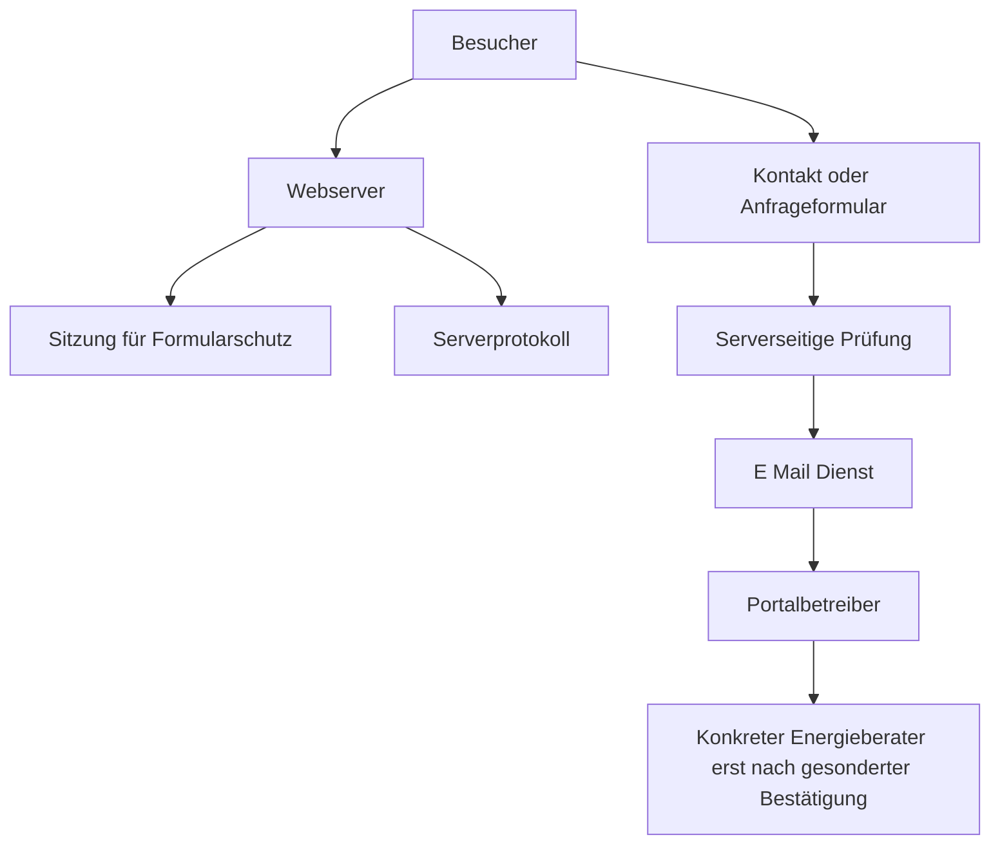

# Datenschutzdokumentation

Diese Dokumentation ist eine technische Arbeitsgrundlage. Sie ist keine rechtliche Freigabe. Alle offenen Angaben müssen vor Veröffentlichung ergänzt und fachkundig geprüft werden.

## Datenflussübersicht

Der Pfad zum E Mail Dienst und eine Weitergabe sind in der Projektfassung deaktiviert. Der letzte Schritt darf nicht als automatische Sammelweiterleitung umgesetzt werden.

## Verzeichnis der Verarbeitungstätigkeiten

| Tätigkeit | Daten | Betroffene | Zweck | Mögliche Rechtsgrundlage | Empfänger | Ort | Löschung | Schutz | AV Vertrag | Einwilligung |
|---|---|---|---|---|---|---|---|---|---|---|
| Webseitenbereitstellung | Internet Protokoll Adresse, Zeit, Adresse, Browserdaten, Status | Besucher | Sichere Bereitstellung | Artikel 6 Absatz 1 Buchstabe f DSGVO, rechtlich prüfen | Hostingdienst | offen | mit Hostingdienst festlegen | HTTPS, Serverhärtung, Zugriffsschutz | voraussichtlich ja | nein |
| Sitzungsschutz | Zufällige Sitzungskennung, CSRF Werte, Startzeit | Formularnutzer | Sicherer Formularbetrieb | Erforderlichkeit und Artikel 6 prüfen | Hostingdienst | offen | Ende der Sitzung | HttpOnly, SameSite, Secure bei HTTPS | Teil des Hostings | nein |
| Kontaktanfrage | Name, E Mail, Thema, Nachricht, Zeitpunkt | Anfragende | Nachricht bearbeiten | Artikel 6 Absatz 1 Buchstabe b oder f, je Anliegen prüfen | Betreiber, E Mail Dienst | offen | verbindlich festlegen | Validierung, Zugriffsschutz | für E Mail Dienst prüfen | keine pauschale Einwilligung |
| Beratungsanfrage | Gebäude, Postleitzahl, Leistung, Beschreibung, Kontaktdaten | Interessenten | Anfrage einordnen | Artikel 6 Absatz 1 Buchstabe b oder f, rechtlich prüfen | zunächst Betreiber | offen | verbindlich festlegen | Validierung, keine automatische Weitergabe | für E Mail Dienst prüfen | erst bei erforderlicher Weitergabe prüfen |
| Anbieteranfrage | Unternehmen, Kontaktperson, E Mail, Webseiten, Leistungen | Anbietervertreter | Aufnahme prüfen | Artikel 6 Absatz 1 Buchstabe b oder f, rechtlich prüfen | Betreiber, E Mail Dienst | offen | verbindlich festlegen | Zugriffsschutz, getrennte Veröffentlichungsfreigabe | für E Mail Dienst prüfen | Veröffentlichung gesondert bestätigen |
| Anbieterprofil | Bestätigte Unternehmens und Personendaten, Bilder | Anbieter und genannte Personen | Öffentliches Profil | Vertrag, Einwilligung oder berechtigtes Interesse je Datum prüfen | Öffentlichkeit | EWR Hosting bevorzugt | bis Widerruf, Vertragsende oder Wegfall des Zwecks mit Prüfung | Freigabeprozess, Änderungsrecht | Hosting | je Inhalt prüfen |
| Anfragebegrenzung | Gesalzener Hash aus Formularart und Internet Protokoll Adresse, Zeitpunkte | Formularnutzer | Missbrauchsschutz | Artikel 6 Absatz 1 Buchstabe f, rechtlich prüfen | Webserver | Serverstandort | nach einer Stunde aus aktiver Liste, temporäre Datei technisch bereinigen | HMAC Hash, kurze Frist | Teil des Hostings | nein |

## Cookies und Endgerätezugriffe

| Name | Technik | Kategorie | Zweck | Dauer | Vor Zustimmung |
|---|---|---|---|---|---|
| `eeb_session` | Sitzungscookie | technisch erforderlich | Formularschutz und einmalige Bestätigung | Browsersitzung | zulässig nach rechtlicher Prüfung der Erforderlichkeit |

Kein Local Storage, kein Session Storage, keine Werbepixel, keine Gerätekennung, keine Statistik und keine externen Medien.

## Auftragsverarbeiter

| Dienst | Anbieter | Zweck | AV Vertrag | Unterauftragnehmer | Drittland | Status |
|---|---|---|---|---|---|---|
| Hosting | offen | Webseite und Protokolle | zu prüfen | zu prüfen | zu prüfen | blockiert Veröffentlichung |
| E Mail Versand | offen | Formularzustellung | zu prüfen | zu prüfen | zu prüfen | Versand deaktiviert |
| Sicherungen | offen | Wiederherstellung | zu prüfen | zu prüfen | zu prüfen | vor Veröffentlichung klären |
| Wartung | offen | technischer Betrieb | Zugriffsrolle prüfen | zu prüfen | zu prüfen | vor Veröffentlichung klären |

## Löschkonzept

Konkrete Fristen werden erst nach rechtlicher Prüfung und tatsächlicher Dienstleisterwahl verbindlich. Folgende Zielwerte sind zu prüfen und zu bestätigen:

| Datenart | Vorgeschlagene Regel | Offener Punkt |
|---|---|---|
| Allgemeine Kontaktanfragen | sechs Monate nach Abschluss, sofern kein Vertrag entsteht | Rechtsgrundlage und betriebliche Notwendigkeit bestätigen |
| Vermittlungsanfragen ohne Vermittlung | drei Monate nach Abschluss | Widerspruchs und Nachweisbedarf prüfen |
| Vermittelte Anfragen | sechs Monate beim Portal, Empfänger informiert selbst | Vertrags und Haftungsfragen prüfen |
| Anbieteranfragen ohne Profil | sechs Monate nach Abschluss | Nachweisbedarf prüfen |
| Öffentliche Profile | bis Ende des Vertrags oder bestätigtem Löschverlangen | Nachlauf für Abrechnung und Rechtsansprüche prüfen |
| Vertragsdaten | bis Ablauf zivilrechtlicher Fristen | konkreten Fristbeginn festlegen |
| Rechnungsunterlagen | gesetzliche Aufbewahrungspflicht | aktuelle Steuerregel prüfen |
| Serverprotokolle | sieben bis vierzehn Tage | mit Hosting und Sicherheitskonzept abstimmen |
| Nachweise erforderlicher Bestätigungen | solange die Verarbeitung darauf beruht, danach nach Rechtsanspruchsprüfung | Beweis und Löschinteressen abwägen |
| Sicherungen | rollierend, vorgeschlagen höchstens dreißig bis neunzig Tage | technische Umsetzbarkeit bestätigen |
| E Mail Korrespondenz | nach Kategorie der zugrunde liegenden Anfrage | Archiv und Postfächer einbeziehen |
| Hochgeladene Dateien | derzeit nicht vorhanden | vor einer Uploadfunktion neues Konzept erstellen |

## Technische und organisatorische Maßnahmen

1. Verschlüsselte Übertragung mit aktuellem TLS
2. Restriktive Server und Dateiberechtigungen
3. Sichere Sitzungsattribute
4. CSRF Schutz, Bot Feld und Zeitprüfung
5. Serverseitige Validierung und sichere Ausgabe
6. Begrenzung wiederholter Anfragen
7. Keine Zugänge im Repository
8. Content Security Policy und weitere Sicherheitskopfzeilen
9. Getrennte Freigabe für öffentliche Anbieterprofile
10. Protokollzugriff nur für notwendige Administratoren
11. Aktualisierungs und Sicherungsverfahren vor Veröffentlichung festlegen
12. Wiederherstellung regelmäßig testen

## Drittlandprüfung

Für jeden Dienst sind Empfängerland, Zugriffsmöglichkeiten, Angemessenheitsbeschluss, Standardvertragsklauseln, ergänzende Maßnahmen und verbleibende Risiken zu dokumentieren. Ohne administrative Freigabe wird kein Dienst mit Drittlandbezug aktiviert.

## Betroffenenrechte

1. Eingang dokumentieren und Frist starten.
2. Identität mit dem geringstmöglichen zusätzlichen Datenumfang prüfen.
3. Betroffene Systeme und Dienstleister bestimmen.
4. Auskunft, Berichtigung, Löschung, Einschränkung, Übertragung, Widerspruch oder Widerruf bearbeiten.
5. Empfänger über erforderliche Änderungen informieren.
6. Entscheidung und Abschluss dokumentieren.
7. Gesetzliche Frist überwachen und bei zulässiger Verlängerung rechtzeitig informieren.

## Datenschutz Folgenabschätzung

Vor neuen Funktionen prüfen:

1. Umfangreiche Bewertung oder Profilbildung
2. Besonders schutzbedürftige Daten
3. Groß angelegte Überwachung
4. Zusammenführung verschiedener Quellen
5. Bewertung von Anbietern oder Personen mit erheblichen Folgen
6. Neue Technik mit unbekannten Risiken

Die aktuelle Portalstruktur ohne Tracking, Bewertungssystem und automatische Weitergabe lässt keine offensichtliche hohe Risikoverarbeitung erkennen. Diese Einschätzung ist nach tatsächlicher Betriebsaufnahme rechtlich zu bestätigen.

## Datenschutzverletzungen und Meldeweg

Mögliche Fälle sind Fehlversand, unberechtigter Postfachzugriff, offengelegte Konfiguration, kompromittierter Server, öffentlich erreichbare interne Daten oder ein falsch veröffentlichtes Profil.

Interner Ablauf:

1. Vorfall sichern und weitere Offenlegung stoppen.
2. Verantwortlichen und Datenschutzkontakt informieren.
3. Art, Umfang, Betroffene und Folgen bewerten.
4. Dienstleister einbeziehen.
5. Meldepflicht und Benachrichtigung innerhalb der gesetzlichen Fristen prüfen.
6. Entscheidung, Maßnahmen und Abschluss dokumentieren.
7. Ursache beheben und Schutzmaßnahmen verbessern.

